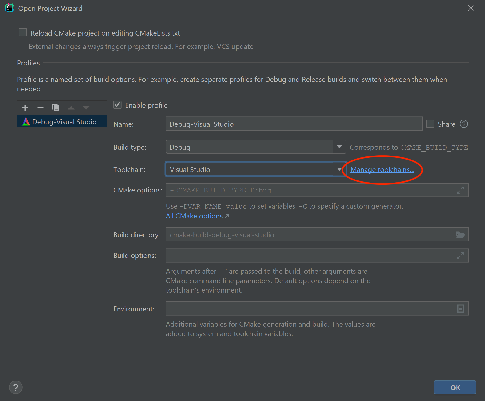

For this course, we will be using [CMake](https://cmake.org) to configure our build environment for proper compilation across different platforms. We will add each lab/assignment/exam as a subdirectory into a single project to allow all of the projects to be visible in the same IDE window.

## Getting Started

Download [CS370\_Fa23.zip](CS370_Fa23.zip), saving it into the directory where you plan on placing all your CS370 projects. **Note: BE SURE THE PATH DOES NOT CONTAIN ANY SPACES.**

Double-click on **CS370\_Fa23.zip** and extract the contents of the archive into a subdirectory called **CS370\_Fa23**

Open CLion, select **Open** from the main screen (you may need to close any open projects), and navigate to the **CS370\_Fa23** directory. This should open the project and execute the CMake script to configure the toolchain.

## Windows

In the popup dialog, in the **Toolchain** drop down select Visual Studio

> 

Then select **Manage toolchains**

> 

In the toolchain dialog, be sure Visual Studio is selected, then in the **Architecture:** dropdown, choose **amd64**

> 

Then click **OK** to exit the dialog boxes. This will set Visual Studio x64 as the compiler for all the projects we'll be importing into this project folder for this course.

Next select **File -> Settings** from the menubar.

> 

In the **Settings** dialog, select the **Tools->Terminal** option, then replace what is in the **Shell path:** setting with

    "C:\cygwin64\bin\sh" -lic 'cd "${OLDPWD-.}"; bash'

> 

If everything is configured correctly, when you select the **Terminal** tab in the lower left corner of CLion it should open up a terminal pane that displays a Cygwin prompt in the **CS370-Fall2022** project directory.

> 

## Mac OSX

In the popup dialog, in the **Toolchain** drop down simply leave the default for Mac OSX which will use the XCode Clang compiler for all the projects we'll be importing into this project folder.

> 

CLion will also simply use the built-in OSX Terminal application.